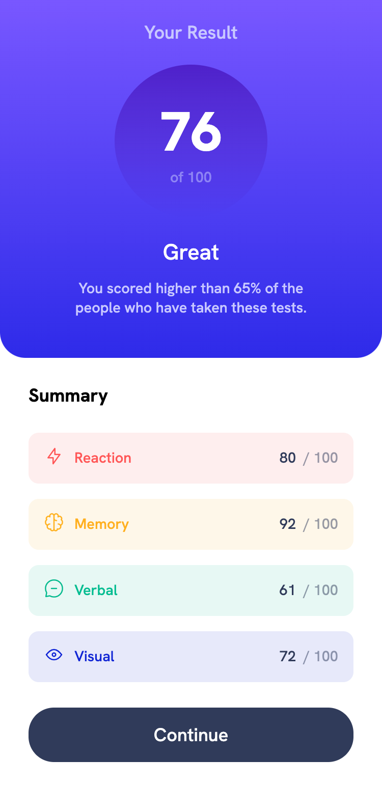
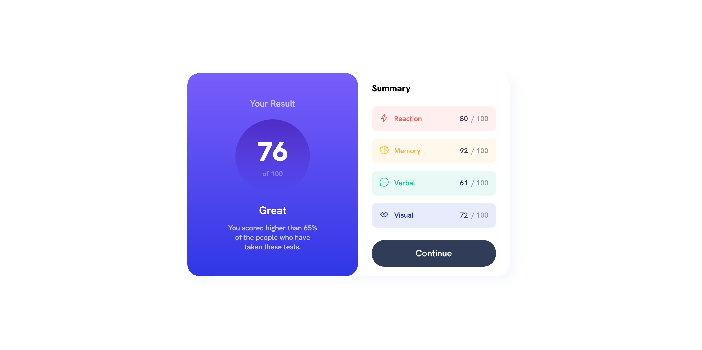

# Frontend Mentor - Results summary component

## Table of contents

- [Overview](#overview)
  - [The challenge](#the-challenge)
  - [Screen Record](#screen-record)
  - [Solution Link](#solution-link)
- [My process](#my-process)
  - [Built with](#built-with)
  - [What I learned](#what-i-learned)
  - [Useful resources](#useful-resources)
- [Author](#author)
- [Acknowledgments](#acknowledgments)

## Overview

### The challenge

[Results summary component](https://www.frontendmentor.io/challenges/results-summary-component-CE_K6s0maV) is a challenge to not only practice Responsive Design, but dive into using a JSON file to display results dynamically

Your users should be able to:

- [X] View the optimal layout for the interface depending on their device's screen size
- [X] See hover and focus states for all interactive elements on the page

### Screen Record

 
 
 

### Solution Link

- Solution URL: [My Solution](https://jen-464.github.io/FrontendMentorChallenges/Newbie/2-Results-Summary/)

## My Process

### Built with

- Semantic HTML elements
- CSS Flex 
- CSS pseudo classes
- Mobile-first workflow
- Fetch API & DOM

### What I learned

Most of my learning came from researching how to display JSON information from a json file to the HTML file. I looked into JavaScript Promise, but ultimately went with the Fetch API as it made more sense. From there understanding how I wanted to lay out my HTML tags through JavaScript was tough and there had to be readjustments. These were necessary as it affected how I could use CSS with it.

### Useful resources

- [Learn JSON in 10 Minutes](https://www.youtube.com/watch?v=iiADhChRriM) - This youtube channel has been the best place to understand concepts for Web Development

- [JavaScript Promises in 10 Minuts](https://www.youtube.com/watch?v=DHvZLI7Db8E) - Here I learned how Promises work from scratch and how that relates to the format Fetch API is written in.

- [Learn Fetch API in 6 Minutes](https://www.youtube.com/watch?v=cuEtnrL9-H0&t=221s) - Ultimately here is where I would properly learn about this topic and debug my code throughout to display the information necessary in HTML. 

- [Align SVG Icons to Text](https://blog.prototypr.io/align-svg-icons-to-text-and-say-goodbye-to-font-icons-d44b3d7b26b4) - I was having issues with aligning the icons to the text and the Medium website seems to have a lot of sources mainly relating to tech.

## Author

- LinkedIn - [/in/jen464](https://www.linkedin.com/in/jen464/)
- Frontend Mentor - [@Jen-464](https://www.frontendmentor.io/profile/Jen-464)

## Acknowledgments

Still super grateful to freeCodeCamp for providing a 21 hour long YouTube video on [Frontend Web Development](https://youtu.be/zJSY8tbf_ys).
